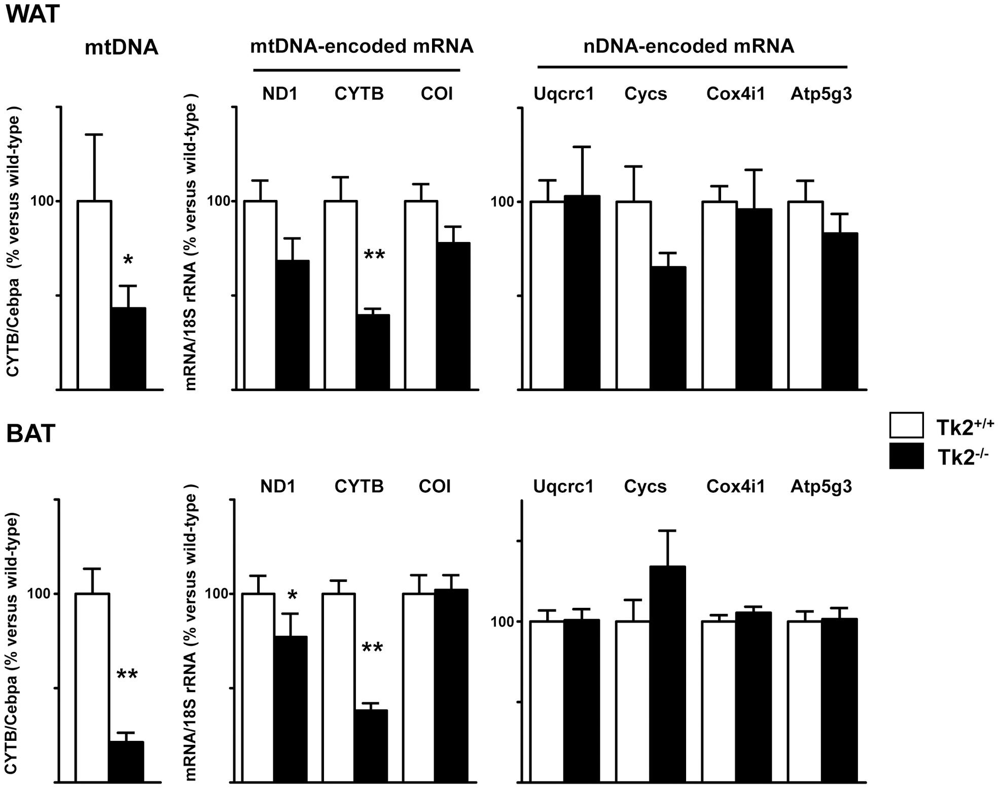

title: Thymidine Kinase 2 Deficiency-Induced Mitochondrial DNA Depletion Causes Abnormal Development of Adipose Tissues and Adipokine Levels in Mice
author: Joan Villarroya
author: Beatriz Dorado
author: Maya R. Vilà
author: Elena Garcia-Arumí
author: Pere Domingo
author: Marta Giralt
author: Michio Hirano
author: Francesc Villarroya
date: 2011-12-27

# Thymidine Kinase 2 Deficiency-Induced Mitochondrial DNA Depletion Causes Abnormal Development of Adipose Tissues and Adipokine Levels in Mice

Joan Villarroya, Beatriz Dorado, Maya R. Vilà, Elena Garcia-Arumí, Pere Domingo, Marta Giralt, Michio Hirano, Francesc Villarroya

[PLOS ONE](http://www.plosone.org/article/info:doi/10.1371/journal.pone.0029691)

## Abstract

Mammal adipose tissues require mitochondrial activity for proper development and differentiation. The components of the mitochondrial respiratory chain/oxidative phosphorylation system (OXPHOS) are encoded by both mitochondrial and nuclear genomes. The maintenance of mitochondrial DNA (mtDNA) is a key element for a functional mitochondrial oxidative activity in mammalian cells. To ascertain the role of mtDNA levels in adipose tissue, we have analyzed the alterations in white (WAT) and brown (BAT) adipose tissues in thymidine kinase 2 (Tk2) H126N knockin mice, a model of TK2 deficiency-induced mtDNA depletion. We observed respectively severe and moderate mtDNA depletion in TK2-deficient BAT and WAT, showing both tissues moderate hypotrophy and reduced fat accumulation. Electron microscopy revealed altered mitochondrial morphology in brown but not in white adipocytes from TK2-deficient mice. Although significant reduction in mtDNA-encoded transcripts was observed both in WAT and BAT, protein levels from distinct OXPHOS complexes were significantly reduced only in TK2-deficient BAT. Accordingly, the activity of cytochrome c oxidase was significantly lowered only in BAT from TK2-deficient mice. The analysis of transcripts encoding up to fourteen components of specific adipose tissue functions revealed that, in both TK2-deficient WAT and BAT, there was a consistent reduction of thermogenesis related gene expression and a severe reduction in leptin mRNA. Reduced levels of resistin mRNA were found in BAT from TK2-deficient mice. Analysis of serum indicated a dramatic reduction in circulating levels of leptin and resistin. In summary, our present study establishes that mtDNA depletion leads to a moderate impairment in mitochondrial respiratory function, especially in BAT, causes substantial alterations in WAT and BAT development, and has a profound impact in the endocrine properties of adipose tissues.

## Results

### Figure 3. Mitochondrial DNA and OXPHOS transcript levels in WAT and BAT from Tk2 H126N knockin mice.

mtDNA relative abundance, and mtDNA- and nDNA-encoded transcript levels in WAT and BAT from Tk2+/+ and Tk2-/- 13-day-old mice. Bars are means ± SEM data expressed as percentage values relative to wild-type controls (*P<0.05; **P<0.01 for Tk2+/+ vs. Tk2-/-; 7-12 mice/group). ND1, NADH dehydrogenase subunit 1; CYTB, cytochrome b; COI, cytochrome c oxidase subunit 1; Uqcrc1, ubiquinol-cytochrome c reductase core protein 1; Cycs, cytochrome c somatic; Cox4i1, cytochrome c oxidase subunit 4 isoform 1; Atp5g3, ATP synthase, H+ transporting, mitochondrial F0 complex, subunit c (subunit 9), isoform 3.
